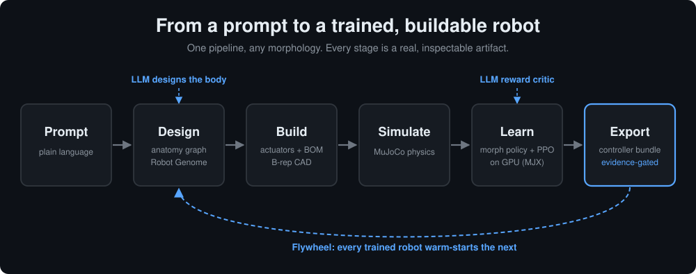

# Virturoid

**An AI-native robot creation engine.** Describe a robot in plain language, and Virturoid designs its body, sizes a real bill of materials, generates fabrication-ready CAD, simulates it in real physics, and trains its controller. Every robot it builds makes the next one faster to create.

You write something like *"a four-legged robot that walks"* or *"a tabletop arm that sorts blocks"*, and the system composes an original body for it, chooses real motors and sensors to build it, runs it inside a physics simulator, and teaches it to move through reinforcement learning.

It runs as a native desktop studio with a live 3D viewport, and the whole engine is also scriptable from the command line. There are no hand-coded robot templates. One general pipeline takes any morphology from prompt to trained controller.



## Table of contents

- [Highlights](#highlights)
- [How it works](#how-it-works)
- [Project structure](#project-structure)
- [Built with](#built-with)
- [Installation](#installation)
- [Usage](#usage)
- [Configuration](#configuration)
- [Roadmap](#roadmap)
- [License](#license)

## Highlights

- **Design from language.** A prompt becomes a structured robot anatomy, then real 3D geometry, through one compiler that handles any body plan.
- **Buildable, not just renderable.** Every joint is matched to a real off-the-shelf actuator, and each design ships with a full bill of materials and B-rep CAD files you could hand to a fabricator.
- **Controllers are learned.** Robots are trained in real MuJoCo physics. A quadruped learns to walk on the GPU, and arms learn a contact grasp. One morphology-agnostic policy architecture drives them all.
- **A flywheel that compounds.** Every trained robot is banked and reused, so each new robot warm-starts from past work instead of training from scratch.
- **AI in two places.** A language model designs the body, and a second language model tunes the training reward when a gait comes out wrong.
- **Evidence-gated.** A readiness check verifies every stage against real artifacts before a design is marked ready to export.

## How it works

Virturoid runs as an explicit pipeline, the one in the diagram above. Every stage produces a real, inspectable artifact, so the path from prompt to trained robot stays transparent instead of hidden in a black box. Each stage, in order:

### 1. From a prompt to a body

You describe the robot in natural language. A language model interprets the request into an **anatomy graph**: its limbs, segments, and joints, their proportions, and how they connect. When no API key is set, a deterministic composer builds the same kind of graph offline.

A single **general anatomy compiler** then turns that graph into real 3D geometry. The same compiler handles a dog, a hexapod, or a robot arm, so there are no per-species templates to maintain. The output is a **Robot Genome**, the canonical specification that every later stage reads.

### 2. Real, buildable hardware

A design is only useful if you could actually build it, so Virturoid grounds every robot in real parts.

- **Actuators.** Each joint is sized to a real off-the-shelf motor from a component catalog, matched to the torque and speed the joint needs.
- **Bill of materials.** The system assembles a complete parts list covering actuators, sensors, compute, and power.
- **CAD.** Geometry is real parametric CAD built with build123d on OpenCascade, exported as B-rep STEP and STL files.

### 3. Learning to move

The Robot Genome compiles to a MuJoCo model and runs in real physics. Control is **learned, not scripted**.

Locomotion uses one **morphology-agnostic policy**: an attention network that reads one token per joint, so the same architecture controls a quadruped, a hexapod, or an arm, and what it learns on one body can transfer to another. Training runs **PPO on the GPU** through MJX, stepping thousands of simulated robots in parallel.

Rather than learn a gait from a dead stop, the policy learns a **residual on top of a rhythmic gait prior**, using position control toward a default stance. A policy that starts from pure noise tends to collapse into a lunge, but giving it a rhythm to refine produces a robot that takes real steps and stays upright. Arms learn a **contact grasp** the same way and can sort objects by color.

### 4. Two AI loops

- **Body designer.** A language model turns the prompt into the anatomy graph.
- **Reward critic.** A second language model reads a diagnosis of how a gait turned out, such as step cadence, balance, and foot clearance, and rewrites the training reward weights to push toward a cleaner result. This applies the language-to-rewards idea to gait quality.

### 5. The flywheel

Every trained body and skill is banked into a **morphology vector space** and a linked **project memory**. When you ask for a new robot, Virturoid finds its nearest neighbors and **warm-starts from their learned weights** instead of training from scratch.

The effect compounds. On a block-sorting task, a second build of a robot reused prior work and cut the number of simulated candidates from 173 to 23, roughly a 7.5x saving. The longer the system runs, the cheaper each new robot becomes, and that growing library is the core asset.

### 6. The readiness gate

Each build is checked stage by stage against the artifacts actually on disk: real CAD geometry, a real physics pass, and measured task outcomes. A design is marked ready to export only when the evidence is present, which keeps the studio honest about what a given robot can really do.

## Project structure

```
virturoid/
├── src/virturoid/
│   ├── schemas/         Typed data models: Robot Genome, BOM, CAD, scenes, training, readiness
│   ├── services/        The engine: anatomy design and compiler, CAD, BOM, physics, training, flywheel
│   ├── desktop.py       Native PySide6 studio with a live MuJoCo viewport (the product)
│   ├── build.py         Generic builder CLI with morphology-aware routing
│   ├── autobuild.py     One-command autonomous build, prompt to working robot
│   ├── compose.py       Compose and co-design a body from building blocks
│   ├── import_robot.py  Import an existing MJCF or URDF robot and train it
│   └── webapp.py        Browser debug surface (not the product UI)
├── scripts/             Training, evaluation, and utility scripts
├── tests/               Test suite
├── viewer/              Browser-based MuJoCo viewer
├── pyproject.toml       Package, extras, and console entry points
└── README.md
```

Good entry points into the engine: `anatomy_designer.py` and `anatomy_compiler.py` (prompt to geometry), `bom_builder.py` and `component_catalog.py` (real parts), `cad_geometry.py` (B-rep CAD), `morph_policy.py`, `learn_locomotion.py`, and `gpu_trainer.py` (learned control), `gait_critic.py` (the reward critic), `design_flywheel.py` and `skill_flywheel.py` (reuse), and `readiness_ledger.py` (the export gate).

## Built with

- **Python 3.10+**
- **MuJoCo** and **MJX** for physics and GPU-parallel simulation
- **JAX** for GPU training, with **PyTorch** for supporting models
- **build123d** on OpenCascade for parametric B-rep CAD
- **PySide6** for the native desktop studio
- **NumPy** as the only required runtime dependency
- Pluggable language-model backends: OpenAI, Claude, a local model through Ollama or vLLM, or a fully offline composer

## Installation

```bash
python -m venv .venv
. .venv/bin/activate            # Windows: .venv\Scripts\activate
pip install -e ".[all]"         # full install, or ".[desktop,sim]" for just the studio
```

The core package needs only NumPy, so `pip install -e .` gives you an importable library and runnable CLIs without the heavy engines. The extras (`sim`, `cad`, `rl`, `desktop`, `web`, `all`) pull in MuJoCo, CAD, and the learning stack as needed.

## Usage

### Desktop studio

```bash
python -m virturoid.desktop
```

Type a prompt in the studio. It composes the body, builds it, simulates it, trains a gait on request, and replays the real episode in the embedded 3D viewport.

### Command line

The studio is the product, but the whole engine is scriptable.

```bash
# Compose a robot, co-design it into a working body, and evaluate it in real physics
python -m virturoid.compose --prompt "warehouse arm to move 2 kg boxes with 0.9 m reach" --co-design --build build/arm

# One command, prompt to a working simulated robot
python -m virturoid.autobuild --prompt "a tabletop arm that sorts red and blue blocks into matching bins" --output build/sorter

# Train and export a controller bundle, plus a runnable ROS 2 package
python -m virturoid.build --train --prompt "a tabletop arm that sorts blocks" --output build/arm_train

# Import an existing robot model and learn a controller for it
python -m virturoid.import_robot --mjcf-file path/to/robot.xml --output build/imported
```

Every build writes a complete package: the Robot Genome, the compiled MuJoCo model, generated task and scene sets, the bill of materials, parametric and B-rep CAD, training artifacts, a controller bundle, and browsable reports. Open `reports/index.html` in any package to explore everything it generated.

## Configuration

Virturoid runs fully offline by default. To enable language-model design, copy the template and set your backend:

```bash
cp .env.example .env
```

| Variable | Purpose |
|---|---|
| `VIRTUROID_LLM_BACKEND` | Which language-model backend to use: `off`, `openai`, `claude`, or `local` |
| `OPENAI_API_KEY` | Your key when the backend is `openai` |
| `VIRTUROID_OPENAI_MODEL` | Model name for the OpenAI backend |
| `VIRTUROID_GPU_SSH` | SSH target of a GPU box for training, for example `user@host` |

## Roadmap

- **Learned humanoid locomotion.** Bring the learning stack from quadrupeds to a balancing biped.
- **Faster, command-conditioned gaits.** Steer a trained policy by target speed and direction.
- **Onboard perception.** Range sensing and vision so robots can act in unknown environments.
- **Sim-to-real transfer.** Carry trained controllers onto physical hardware.

## License

Released under the MIT License. See [LICENSE](LICENSE).
