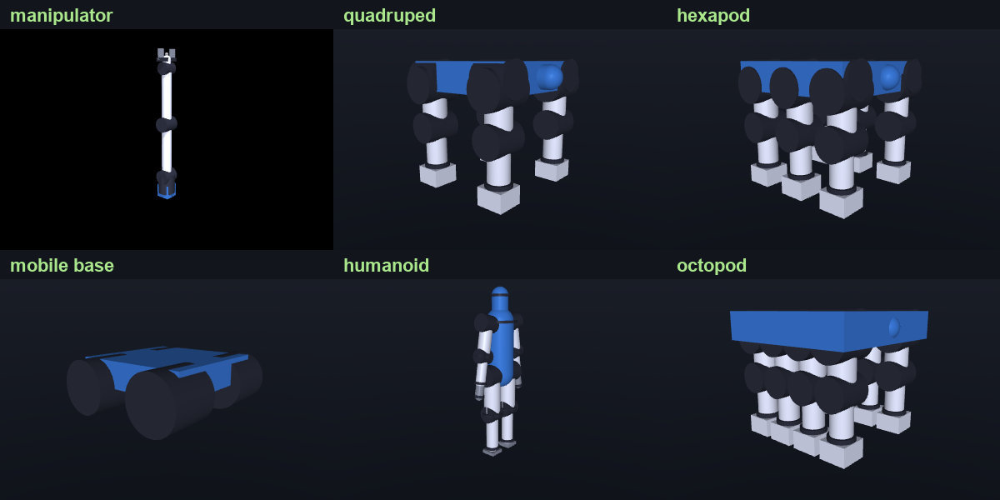
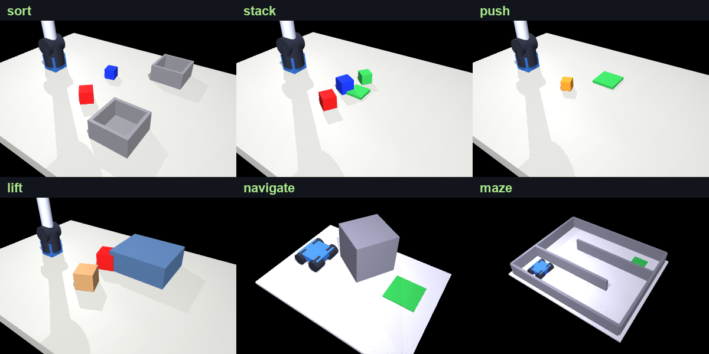

# Virturoid

**An AI-native layer over robotics simulation.** Bring a robot you already have — a URDF, an MJCF, or a whole project folder — or describe one in plain language. Virturoid grounds it in real parts, verifies it in real physics, amends it when you ask, fits a controller to that specific body, and exports a deployable package. Your own AI agent drives every stage over MCP, on your own subscription and your own keys.

Hand it a Unitree Go2's MJCF and ask it to carry more, and it re-sizes the motors, updates the bill of materials, and re-verifies the result in physics. Or write *"a four-legged robot that walks"* and it composes an original body, chooses real motors and sensors to build it, and fits a gait to that body against a verdict that can see it fall. Every physics-verified result is banked against a morphology key, so the next similar body starts from a real operating point instead of from zero.

It runs as a native desktop studio with a live 3D viewport, is scriptable from the command line, and exposes every stage as an MCP tool. Bodies are composed per prompt through one general compiler — nothing is copied from a real robot and there is no per-species catalog — covering legged bodies from 1 to 12 legs, manipulators, mobile bases, humanoids, and mobile manipulators.


Every body below was generated from a one-line prompt by the same pipeline — no per-species templates:



## At a glance

|  |  |
|---|---|
| **Scale** | ~160k lines of Python; 391 source modules, 388 test modules |
| **Tested against real robots** | Descriptions from the [MuJoCo Menagerie](https://github.com/google-deepmind/mujoco_menagerie) — Unitree Go2 / G1 / H1 / A1, Boston Dynamics Spot, ANYmal C, Franka Panda, UR5e, PAL Talos, Agility Cassie, ALOHA — rather than fixtures, because fixtures have lied here before |
| **Agent surface** | 75 tools over MCP (stdio JSON-RPC). Your agent, your keys; `llm_spend` reports our own per-role call count so zero-spend is measurable rather than promised |
| **Physics** | MuJoCo on CPU; MJX on GPU behind an enforced CPU↔GPU parity gate |

**If you read four files, read these** — they carry the ideas:

- **[`gait_quality.py`](src/virturoid/services/gait_quality.py)** — the un-gameable verdict. Forward distance is a Goodhart magnet, so travel counts only when the robot also stayed upright, kept a real step cadence, survived the episode, and **held its course**: a robot walking in a closed circle is named as *circling*, not credited with the distance. Success is owned by this classifier and never by a reward an agent authored, so nothing can optimise its way to a passing grade.
- **[`sysid/fit.py`](src/virturoid/services/sysid/fit.py)** — system identification that refuses. It fits joint damping, reflected inertia and dry friction with confidence intervals, declines to write any parameter the experiment could not actually load, and ships `what_this_gate_does_not_catch` in every verdict. Two "by construction" bounds in this file were disproved by measurement and are retracted in place rather than quietly deleted.
- **[`morphology_embedding.py`](src/virturoid/services/morphology_embedding.py)** — how a new robot finds the robots most like it: a Weisfeiler-Lehman fingerprint over the kinematic graph plus log-compressed mass, so a composed quadruped and an imported Go2 land near each other (0.72) and a snake does not (0.015).
- **[`agent_tools.py`](src/virturoid/services/agent_tools.py)** — the surface an external agent drives, and the disclosure contract every tool answers under.

## Table of contents

- [At a glance](#at-a-glance)
- [What makes it different](#what-makes-it-different)
- [What it does](#what-it-does)
- [How it works](#how-it-works)
- [Project structure](#project-structure)
- [Built with](#built-with)
- [Installation](#installation)
- [Usage](#usage)
- [Connect your own AI agent (MCP)](#connect-your-own-ai-agent-mcp)
- [Configuration](#configuration)
- [Recent improvements](#recent-improvements)
- [Roadmap](#roadmap)
- [License](#license)

## What makes it different

- **Your agent drives it, on your keys.** Every stage — ingest, amend, verify, train, export — is an MCP tool your own Claude or Codex session calls directly. Virturoid spends no language-model tokens of its own, and that is measurable rather than promised: the `llm_spend` tool reports per-role internal call counts, and `VIRTUROID_NO_INTERNAL_LLM=1` hard-disables every internal role.
- **It runs the whole loop, not one slice.** Most tools stop at generating a shape, or at a physics demo, or at a controller. Virturoid goes from a robot you own — or a sentence — to a grounded buildable body, to a controller fitted to it, to a robot measured on a task, to an export bundle.
- **Every robot is original.** Bodies are composed per prompt through one general compiler. Nothing is retrieved from a catalog of stock models or stitched together from existing robot parts. One exception, and it is disclosed: when a composed legged body still cannot walk after being fitted with its own controller, the engine may substitute a shared reference quadruped — labelled in the output and written into that robot's own notes.
- **One policy architecture spans bodies.** A single morphology-agnostic network (one token per joint) can be trained on a quadruped, a hexapod, or an arm without rewriting the learning code, and it converges in simulation. It is not what ships as the default controller, and reusing a trained *policy* across morphologies is built but not yet demonstrated end to end; no artifact in this checkout clears the bank's own credibility screen.
- **It banks what it verifies, and reports what that is actually worth.** Every physics-verified result is banked with the error bar that admitted it, and a new search starts from the nearest prior body instead of cold. Measured on our own bank, the honest picture is mixed: recall reliably fires and hands a new body a real banked operating point, and most of the time that changes nothing — across 2163 recorded deploys of a mined hint, 246 wins, 283 losses, 1634 ties. A warm-started search gains about **+0.08 m over its own banked seed** across 594 recorded reuses; **no cold-start control arm has ever been run**, so this is not a warm-versus-cold result. *Mining* the bank for universal parameter rules does not work at all yet: zero of five parameters clear the evidence gates, and the apparent signal got weaker as the corpus grew more diverse. The library is the asset; the claim that it compounds is not yet earned, and the app reports the negative number rather than hiding it.
- **Your agent authors the objective, the code owns the verdict.** A language model turns the prompt into the anatomy graph; your agent then writes the training objective in a closed reward DSL — parsed and bounded, never raw `exec`, with anti-gaming detectors. The loop trains, decomposes the reward into its additive terms, names the one that saturated, and the agent re-proposes against that. Whether a run *counts* stays with the un-gameable classifier, separately from whatever the reward says its value was.
- **It is honest by construction.** A robot is marked ready to export only when real artifacts back every stage, and a gait is scored by real foot contact and balance.

## What it does

**Design**
- Generates an original robot body from a natural-language prompt.
- Realizes legged bodies (1 to 12 legs), manipulators, mobile bases, humanoids and mobile manipulators through one general anatomy compiler, with no per-species templates. Out of scope today, and named rather than silently redirected: fixed-wing and flapping-wing flight (a flight request is realized as a rotor platform, and the build says so), wheel-legged hybrids, and soft or continuum bodies.
- Runs fully offline with a deterministic composer when no language model is configured. With no agent, the same steps run with conservative defaults and every choice is marked as a *default* rather than a reasoned decision — the honesty is identical, the judgment is not.
- Co-designs the body, physics-tuning it into a working robot before it is built.

**Build**
- Sizes every joint to a real off-the-shelf actuator from a component catalog.
- Assembles a complete bill of materials: actuators, sensors, compute, and power.
- Produces real parametric B-rep CAD with build123d, exported to STEP and STL.
- Adapts materials to the task, such as heavier steel for load or lighter carbon for agility.

**Simulate and learn**
- Compiles each robot to a MuJoCo model and trains it in real physics.
- Fits a walking gait to each new body by search (CEM) against an un-gameable verdict; optional GPU training (MJX PPO) behind a CPU↔GPU parity gate when a CUDA box is attached.
- Learns a contact grasp for arms, which can sort objects by color.
- Trains under domain randomization (actuator gain, joint stiffness, sensor noise, and pushes) so a controller does not depend on one exact set of dynamics parameters. This is robustness *inside* simulation, not demonstrated transfer to hardware.

**Run tasks**
- Proposes a verifiable task from the prompt and checks it against the robot's morphology.
- Generates the scenes to test it, then runs the real skill: pick and place, sort, navigate, or locomote.
- Measures the outcome instead of assuming it.

**Close the sim-to-real gap on a robot you own**
- Writes the bench experiment to run on your actual hardware: a short, safe, information-rich command sequence, one joint at a time, with every amplitude bounded by that joint's own declared limits and every frequency bounded by the datasheet torque and no-load speed of the motor its bill of materials sized. A joint it cannot move safely is reported as such rather than commanded anyway.
- Measures the gap from the log you send back — **per joint, in radians, milliseconds and newton-metres, never a single fidelity score**. It replays your commands through the simulator to compare trajectories, then subtracts the simulator's own inverse dynamics from your measured torque and regresses the remainder on the model's sensitivity, so it names *which* joints and *which* parameters are responsible. Actuation delay is read from the log's own applied torque against the control law the bench plan shipped, with **no dynamics model in that path** — so the delay answer holds whether or not the parameter fit does. A current log is converted through the datasheet torque constant (stated, never silent), and a position-only log has its applied torque recovered by pointwise inverse dynamics. Re-simulating the closed loop across a delay grid is reported beside these as a cross-check, but is never allowed to claim the answer: its minimum is biased toward zero whenever the model is wrong, which is exactly when you are asking.
- Fits each joint's viscous damping, reflected inertia and dry friction with a **confidence interval, not a point estimate**, and applies only what survives two refusals: parameters the experiment could not actually load are reported as unidentified rather than guessed, and a fit that does not measurably improve how the simulator tracks your log is withheld from the model entirely. A fit that **one number explains better than forty-two do** is withheld and named. That last one matters because tracking improvement alone is *not sufficient*, and we measured where it fails: a wrong gear ratio or torque constant is partly absorbable by the parameters we do fit, so it genuinely improves tracking and would otherwise be written into your robot. Raising the threshold cannot fix it — a correctly-specified fit was measured *below* a misspecified one, so the populations overlap. Instead the engine replays your prior model with a single scaled gear and refuses when that one-number rival tracks your log at least as well, pointing you at your drivetrain instead of silently editing your parameters. The same test with an inertia scalar catches a misstated inertia tensor and points you at your CAD. And a log too physically implausible to support any verdict is refused as a *log*, blaming neither. Every applied calibration is reversible in one call and carries the prior it replaced, and every verdict — pass or fail — ships a `what_this_gate_does_not_catch` field naming the classes still invisible to it, including a drivetrain error superposed on a real dissipation change and any error confined to a subset of joints. One limit worth stating plainly: the three joint parameters are **written into your model**, but the identified actuation delay is **only reported** — MuJoCo has no transport delay and every actuator compiles at `dyntype=none`, so the delay is used to score the tracking gate rather than shipped with your twin, and the actuator-fidelity level that would require it stays correctly blocked.
- No hardware yet? The same journey runs against a deliberately perturbed copy of the model, and labels every result as a simulation rather than a measurement — including refusing to raise the actuator-fidelity level. Honest scope: this validates the pipeline and the estimator, not the physics. Both sides are MuJoCo there, so MuJoCo's own modelling error cancels, and that is exactly the error a real log exists to expose. **No number we publish has been validated against a physical robot; the first hardware log needs a design partner.**

**Reuse and organize**
- Banks every trained body and skill into a morphology vector space and a linked project memory.
- Warm-starts each new robot from the most similar past work instead of training from scratch.
- Places every design into a self-organizing species tree.

**Use it**
- A native desktop studio with a live MuJoCo viewport, or a full command-line interface.
- Edits a built robot in plain language — make it taller, give it carbon-fiber legs, or make it carry 10 kg — and re-engineers the body for it, sizing bigger motors and updating the bill of materials, then re-verifying. On an imported robot the edit **names any of your figures it replaced**, per link and side by side (`FL_calf: your 0.241 kg, our derived 2.191 kg`), because a count of changed links reads as *your edit moved these* rather than *your measurements were swapped for our model's*. Adding a payload your actuators cannot deliver is a refusal that names the joint and the margin, not a limit quietly raised to make it fit.
- Tells you what a long build is doing, and lets you bound it. Every stage reports as it runs, with a heartbeat while a search is in progress and an up-front statement of what it may cost measured on *your* body (`one 6000-step rollout costs 0.6 s here, and the search may run up to 360 of them`). `gait_budget_s` and `gait_max_evals` bound it, and a build that stopped early says so — a partial search is never reported as a completed one, and never as a finding about your robot.
- Ingests an existing robot project: drop a folder with a URDF or MJCF model, a bill of materials, CAD meshes, and a plain-English description, and one agent parses all of it into a single editable, simulate-able robot — even when the referenced meshes are missing.
- Reads and improves your own controller: it extracts the parameters from your control script, a sibling params file, or an ONNX policy, warm-starts a gait search from them, and keeps the result only if it beats yours on the un-gameable verdict. A Python controller's *code* is deliberately never executed — the tool reports that it was not run rather than quietly substituting a default — and an ONNX policy is validated one inference at a time rather than driven as the rollout controller.
- Exports a controller bundle, a runnable ROS 2 package, and browsable reports. For legged robots the bundle carries the tuned, verified gait; for arms it currently carries a reach controller plus a scripted friction grasp, and the learned grasp policy is evaluated in simulation but not yet wired into the export.
- Compiles the deployable stack from the robot's own parts list: a sensor-fusion configuration (EKF, AHRS, wheel or leg odometry) built from the BOM's actual sensors on their actual mount links and honest about states that sensor set cannot observe, plus an observation assembler, a safety filter clamped to datasheet peak torque, a state machine, a watchdog and a calibration routine. Every emitted script is compile-checked and dry-run in simulation, with that verdict written into the package.
- Hands off to NVIDIA Isaac Sim / Isaac Lab: exports an OpenUSD physics articulation (transcribed from the exact model Virturoid simulates, then re-read and round-tripped through OpenUSD to confirm it loads cleanly) plus a ready-to-edit Isaac Lab `ArticulationCfg` with real per-joint motor limits, a standalone spawn script, and, for legged robots, a velocity-tracking locomotion environment that subclasses Isaac Lab's own task. Virturoid designs and pre-screens the robot; your Isaac pipeline does the high-fidelity training and sim-to-real.

## How it works

Virturoid runs as an explicit pipeline, the one in the diagram above. There are two front doors — a robot you already have, or a robot you describe — and everything after them is shared. Every stage produces a real, inspectable artifact, so the path stays transparent instead of hidden in a black box. Each stage, in order:

### 1. Bring your own robot

Virturoid is a simulation home for robots you already have, and this is the door most people come through. Drop a project folder — a URDF or MJCF model, a bill of materials, CAD meshes, and a plain-English description like *"aluminum chassis, carbon-fiber legs, carries a 5 kg payload"* — and one ingestion agent parses all of it into a single editable robot. It imports the model (recovering the kinematic structure even when the referenced meshes are missing), reads the description into typed materials and payload and applies them, and carries the parts list with its provenance. From there the same tools that build a robot amend and improve it: ask it to carry more and it re-sizes the motors and updates the bill of materials. Everything from stage 3 onward applies to this robot exactly as it does to a generated one.

**Two lanes, and it tells you which one ran.** Your model is loaded as-is through the repair pass and kept, and an editable approximation is derived from it so the edit and training stack can work on it. Today's verdicts, BOM, cost and exports are produced by stepping that approximation, not your original file — a deliberate, disclosed design choice rather than a claim that the two agree. Every ingest emits a report with three ledgers: what was **understood**, what was **guessed** (with the basis for each guess and how to correct it), and what was **dropped** and why. The lane that ran is a required field in that report, not optional prose. An ingested robot is judged under the rubric for the class it actually is, so a legged body is never scored as a wheeled one.

**Where your robot goes.** Ingest runs locally: no upload, and no network access during the project scan. Everything the flywheel banks is written to your own local build directory and nothing is transmitted. Imported models stay yours, and derivatives exported from them inherit your license rather than ours — an import is never used as source material for the "original" bodies the composer generates. Stated honestly in the other direction: tenant isolation, deletion controls and private-retrieval filters are **not implemented**, so this is a single-tenant local posture, not a multi-tenant guarantee, and it is not a compliance claim.

**What it will refuse.** An imported robot is verified at its real scale, and when the scripted gait cannot walk it, the product says *"no credible gait yet at this scale"* and offers to learn one for the real body rather than substituting a template or inflating the verdict. Measured: an ingested Go2 stands, but does not yet walk under the scripted gait stack. Scope of the front door itself: URDF and MJCF load; a xacro template must be expanded first and the importer prints the one-line command to do it; SDF and USD are recognized and named rather than silently ignored; log and bag formats are detected but not yet used to calibrate the simulation. An imported bill of materials is unit-normalized, deduplicated and carried as the cost and parts record — reconciling its masses into the simulated model's link inertials is not yet applied, so the sim-mass-equals-BOM-mass result quoted later is about generated bodies, not imports.

### 2. From a prompt to a body

You describe the robot in natural language. A language model interprets the request into an **anatomy graph**: its limbs, segments, and joints, their proportions, and how they connect. When no API key is set, a deterministic composer builds the same kind of graph offline.

A single **general anatomy compiler** then turns that graph into real 3D geometry. The same compiler handles a dog, a hexapod, or a robot arm, so there are no per-species templates to maintain. The output is a **Robot Genome**, the canonical specification that every later stage reads. An optional **co-design** step physics-tunes the body before it is built, so it is shaped to actually perform its task.

### 3. Real, buildable hardware

A design is only useful if you could actually build it, so Virturoid grounds every robot in real parts.

- **Actuators.** Each joint is sized to a real off-the-shelf motor from a component catalog, matched to the torque and speed the joint needs.
- **Bill of materials.** The system assembles a complete parts list covering actuators, sensors, compute, and power.
- **CAD.** Geometry is real parametric CAD built with build123d on OpenCascade, exported as B-rep STEP and STL files, with materials chosen to fit the task.

### 4. Learning to move

The Robot Genome compiles to a MuJoCo model and runs in real physics. What ships today is a **scripted gait that is tuned per body by search** — and the tuning is real learning, not a lookup.

A structural wave-gait engine drives **three or more legs** — it lifts one leg at a time so the remaining feet always hold the centre of mass, which is exactly why it cannot balance a biped and says so instead of pretending (a two-legged body is in single support for its entire cycle; balancing one is a learned-control problem we have not solved). A **CEM search** fits that gait's parameters to each new body against an un-gameable reward: forward travel counts only when the robot also stayed upright, kept a real step cadence, survived the episode, and **held its course** — a robot travelling in a closed circle is named as circling, not credited with the distance. Leg **stiffness** turned out to be the decisive dimension: on a spindly body the same gait is rejected as a *slide* at `kp=32` and passes as a **credible walk** at `kp=250`. An OpenAI-ES trainer for morphology-agnostic policies (an attention network reading one token per joint) also runs on CPU.

**GPU training is wired but optional.** With a CUDA box attached, MJX runs PPO over thousands of parallel robots behind an enforced CPU↔GPU parity gate, and a policy is only banked if it earns a credible verdict on the CPU deploy path. PPO converges in simulation; closing the last of the sim-to-deploy gap into a banked neural walk is the open frontier, so **no learned neural policy ships as the default controller** — the honest headline is *tuned, verified gaits that compound as reusable assets*.

Rather than learn a gait from a dead stop, the policy learns a **residual on top of a rhythmic gait prior**, using position control toward a default stance. A policy that starts from pure noise tends to collapse into a lunge, but giving it a rhythm to refine produces a robot that takes real steps and stays upright. Arms learn a **contact grasp** the same way. Training can run under **domain randomization** so a controller does not depend on one exact set of dynamics parameters — sim-side robustness, not demonstrated hardware transfer.

### 5. Running a task

A robot is judged by whether it can do the job, not just whether it stands up. From the prompt, Virturoid **proposes a verifiable task**, checks it against the robot's morphology so the task fits the body, **generates a scene specific to that task** — sorting bins, a stacking target, a push goal, a lift shelf, a navigation course, or a maze sized to the robot — and runs the matching **real skill**: pick and place, sort, navigate, or locomote. The result is measured, and a build that fails its task is reported as such.



### 6. Two AI loops

- **Body designer.** A language model turns the prompt into the anatomy graph.
- **Reward author.** Your agent writes the training objective in a closed reward DSL — parsed and bounded, never raw `exec`, with anti-gaming detectors. The loop trains, decomposes the reward into its additive terms, and names the one that saturated or went flat; the agent re-proposes against that. A reward that certifies a body is banked against the morphology key, so the next similar body recalls it as a seed rather than starting from a blank objective.

Two properties hold across both loops. **Success stays owned by the code, not by the reward** — the un-gameable classifier decides whether a run counts, separately from whatever the reward says its value was, so an agent cannot author its way to a passing verdict. And reward-steered training is the CPU search path today; DSL rewards do not steer GPU PPO by default.

### 7. The flywheel

Every verified gait and skill is banked into a **morphology vector space** and a linked **project memory**. A banked row is small and concrete: the tuned open-loop gait parameters that worked on one body, plus the error bar and the fragility gate that admitted them. Recall is keyed on a structural morphology vector — a Weisfeiler-Lehman fingerprint over the body's kinematic graph plus log-compressed mass — gated first by a hard same-weight-bearing-leg-count filter and an exact-structure cache. When you ask for a new robot, Virturoid finds its nearest neighbors and **warm-starts from their tuned parameters** instead of searching from scratch: a brand-new quadruped recalls real banked gait parameters, not the shipped defaults.

**What that is worth today, measured.** Recall reliably fires and hands the new body a real operating point — and most of the time it changes nothing. Across 2163 recorded deploys of a mined hint: 246 wins, 283 losses, 1634 ties. The embedding separates *classes* well (a composed quadruped scores 0.72 against a template quadruped and 0.015 against a snake), but within a class, similarity does not predict whether a specific banked gait will transfer to a specific new body — which is exactly why the system still runs a search rather than trusting the neighbour. The binding constraint is corpus **diversity**, not corpus size: the apparent signal in the bank got *weaker* as more distinct bodies entered it, which is what you would expect if the earlier signal was one body supplying many rows.

So what is measured is **asset compounding**: the library of verified, recallable gaits grows with use, and warm-started bodies start from a working region instead of zero. The harness that would prove *capability* compounding — a held-out success curve against shuffled-label and other controls — is built and unit-tested, but has not been run at corpus scale, so it is stated as designed, not proven. Nothing in this checkout measures whether the Nth robot is *cheaper* than the first.

### 8. The readiness gate

Each build is checked stage by stage against the artifacts actually on disk. Evidence-gated stages: real CAD geometry, a real physics pass, the bill of materials, actuator feasibility, schema validity, simulation compile, and measured task outcomes. A design is marked ready to export only when that evidence is present, which keeps the studio honest about what a given robot can really do.

One stage is not evidence-gated, and you should know which: the **exported controller** is currently checked for presence, not for performance. Its own measured verdict travels separately inside the exported control program as `verified_walk` — that is the field to read if you want to know whether the controller in your package actually walks.

**How often does the generation path succeed?** On a 20-prompt battery of deliberately hard and novel prompts, the live lane returned an answer for 10: **one** earned a credible verdict, five built bodies that do not move, and four were honest refusals. That is a hard novel-prompt battery, not the quadruped and arm prompts the demo runs, and the number to hold in mind when reading anything above. The deterministic offline figure (0.55) is a regression tripwire on the compiler and physics, **not** a capability number, and `correct@1` — which counts a correct refusal as correct — must not be read as one either.

## Project structure

```
virturoid/
├── src/virturoid/
│   ├── schemas/         Typed data models: Robot Genome, BOM, CAD, scenes, tasks, training, readiness
│   ├── services/        The engine: anatomy design and compiler, CAD, BOM, physics, training, tasks, flywheel
│   ├── ui_server.py     Build Console: the product UI (native window or browser), serves webui/
│   ├── build.py         Generic builder CLI with morphology-aware routing
│   ├── autobuild.py     One-command autonomous build, prompt to working robot
│   ├── compose.py       Compose and co-design a body from building blocks
│   └── import_robot.py  Import an existing MJCF or URDF robot and train it
├── webui/               Build Console front end: 3D viewport, episode playback, outliner, memory
├── scripts/             Training, evaluation, and utility scripts
├── tests/               Test suite
├── pyproject.toml       Package, extras, and console entry points
└── README.md
```

Good entry points into the engine: `anatomy_designer.py` and `anatomy_compiler.py` (prompt to geometry), `bom_builder.py` and `component_catalog.py` (real parts), `cad_geometry.py` (B-rep CAD), `morph_policy.py`, `learn_locomotion.py`, and `gpu_trainer.py` (learned control), `task_proposer.py`, `task_verifier.py`, and `task_executor.py` (running a task), `gait_critic.py` (the reward critic), `design_flywheel.py` and `skill_flywheel.py` (reuse), and `readiness_ledger.py` (the export gate).

## Built with

- **Python 3.10+**
- **MuJoCo** and **MJX** for physics and GPU-parallel simulation
- **JAX** for GPU training, with **PyTorch** for supporting models
- **build123d** on OpenCascade for parametric B-rep CAD
- **Three.js** front end served by a built-in Python server, run as a native window or in the browser
- **NumPy** as the only required runtime dependency
- Pluggable language-model backends: OpenAI, Claude, a local model through Ollama or vLLM, or a fully offline composer

## Installation

```bash
git clone https://github.com/Haripratiik/Virturoid.git && cd Virturoid
python -m venv .venv
. .venv/bin/activate            # Windows: .venv\Scripts\activate
pip install -e ".[sim]"         # physics + CAD: everything below runs on this
```

**`.[sim]` is the install to start with.** It is what the demo, the studio, the verdicts and the CAD export
actually use. Measured on a clean venv (Windows, Python 3.13): **223 s to install, 696 MB on disk** — most of it
OpenCascade, which is what makes the CAD real. `.[all]` also pulls PyTorch, JAX and PySide6 (several GB) and is
only worth it once you want GPU training or the native desktop window.

**`pip install -e .` is what makes `import virturoid` work.** The package lives in `src/`, so a clone alone is
not importable — without the editable install, `import virturoid` fails from every directory, including the
repo root. The core install needs only NumPy (69 MB venv) and gives you an importable library plus the
`virturoid`, `virturoid-build`, `virturoid-import` and `virturoid-mvp` commands; the extras add the engines.

Not ready to install? The two entry-point scripts — `scripts/run_mvp_demo.py` and `scripts/run_ui.py` — put
`src/` on `sys.path` themselves, so those two run straight from a clone (you still need MuJoCo). Everything
else, including your own code, expects the install or `PYTHONPATH=src` (Windows: `set PYTHONPATH=src`).

| Extra | Pulls in | For |
|---|---|---|
| *(none)* | NumPy | schemas, planning, memory, the CLIs |
| `sim` | MuJoCo, Pillow, build123d | **start here** — physics, verdicts, renders, STEP/STL CAD |
| `web` | FastAPI, uvicorn | the FastAPI web app (`run_ui.py` itself needs nothing extra) |
| `desktop` | PySide6, pywebview | Studio as a native window instead of a browser tab |
| `rl` | JAX, PyTorch | GPU/MJX training and the morphology-aware policies |
| `isaac` | usd-core | the OpenUSD / Isaac Lab hand-off |
| `llm` | openai, anthropic, requests | the LLM design backends (offline is the default) |
| `all` | all of the above | full local development |

## Usage

### Start here — two robots, no API key, no GPU (**allow 4–10 minutes**)

```bash
python scripts/run_mvp_demo.py --mini      # -> build/demo/index.html : robots built from text, each with its verdict
```

**Budget the time before you start it.** This used to be documented as "~1 minute" and it is not: two cold runs
on the development machine measured **212 s and 336 s**, and an evaluator on a different machine measured
**579 s**. Almost all of it is one stage — the quadruped's `create_robot` took 202 s, 321 s and 574 s in those
three runs, while the arm that follows it took **7 s**. That is not a hang and it is
not overhead — `create_robot` grounds the body to its real mass and then *searches* for a gait that fits that
particular body, against a verdict that can see it fall. Fitting a body's controller to the body is the
expensive, honest version of that step; the cheap version is scoring your robot at some other robot's
hand-tuned operating point, which is what the search exists to stop.

So the run talks while it works. Every stage announces itself, reports what it cost, and prints a
`... still running` line every 15 seconds with a clock in the left margin:

```
[0:00]    [1/2] a quadruped robot dog
[0:00]       create_robot ... (compose -> ground the mass -> fit an operating point to THIS body ...)
[0:15]         ... still running: create_robot (15s)
[3:22]       done create_robot in 202.2s
[3:23]       done verify_robot (quick) in 0.5s
[3:23]    -> CREDIBLE WALK  (203.8s for this robot)
```

The output is a self-contained gallery: every robot is composed from a prompt, simulated in MuJoCo, and
labelled with the verdict it actually earned — including the ones that fail. Nothing here calls an LLM, so it
runs on a fresh clone with no keys configured — and the page says so at the top, naming the design path it
resolved and stamping every card with the one that produced that body. Run `--llm` (or set
`VIRTUROID_LLM_BACKEND=openai` + `OPENAI_API_KEY`) to have a language model author the anatomy instead of the
offline compositor. The same physics, the same verdict gate and the same export path run either way — but the
*outcomes* are not. On the prompt battery where both lanes were measured they disagreed on about half the
prompts, in both directions, so the offline gallery's verdicts should not be read as the LLM lane's. LLM design
is also stochastic: the same prompt can yield a different body and a different verdict on a second run
(measured: 1 of 5 repeated prompts reproduced its outcome).

The full run (`python scripts/run_mvp_demo.py`, **measured 703 s / 11m43s** on the same machine) builds seven
bodies — four of them legged, each with a flywheel learning pass — and adds the measurement that matters most: a
**same-family comparison** — three quadruped-animal prompts, three measurably different bodies, each verified on
its own, with a `SUBSTITUTED` column that says so if the walkability gate ever replaces one with a shared
template. `--no-compare` skips it; `--no-learn` skips the learning passes.

### Virturoid Studio (the app)

Studio is the real frontend — a React + Vite desktop/web app (source in [`frontend/`](frontend/), served by the
Python backend at `/studio/`). **The built bundle is committed, so a clone needs no npm step:**

```bash
python scripts/run_ui.py --ui studio --web --port 8765    # -> http://127.0.0.1:8765/studio/
python scripts/run_ui.py --ui studio                      # or as a native desktop window (needs the desktop extra)
```

With `--ui studio`, `http://127.0.0.1:8765/` **redirects to `/studio/`** and the older lightweight build console
keeps its own address at `/legacy`. (Without the flag it is the other way round: the console is at `/`, Studio
still at `/studio/`.) Opening the root and landing on the legacy console — whose viewport reads *"Unknown
package."* until you pick one — was the single easiest way to conclude the app was broken while Studio was
running one path segment away.

**What you should see on a fresh clone:** four demo robots (`arm_sort`, `dog_walk`, `hexapod_walk`, `humanoid`)
in the Robot Library — they are tracked in git under `build/ui_verify/`, and the server falls back to them when
your own build root is still empty. The status column is deliberately unflattering: most of them read
`UNVERIFIED` until you verify them. If the library *is* empty it now says which directory it scanned and how to
fill it, instead of showing a blank grid.

If you change the frontend, rebuild it with `cd frontend && npm install && npm run build`, or develop against
it with hot reload (below).

Describe a robot to the build assistant and it builds it in the live 3D viewport. Switch the viewport to **Episode** to replay the trained motion, open **Memory** for the cross-robot species tree, and **Analysis** for evaluation detail. To develop the frontend with hot reload, run the backend as above and `cd frontend && npm install && npm run dev` (Vite serves `http://localhost:5173/studio/` and proxies the API to the backend).

The original lightweight Build Console is also reachable directly with `python -m virturoid.ui_server [--web --port 8765]`.

The native desktop window needs the `desktop` extra (`pip install -e ".[desktop]"`, which pulls in `pywebview`);
without it the launcher says so and falls back to the browser. (`site/` is a separate Astro marketing site and is
not part of the app.)

### Command line

The studio is the product, but the whole engine is scriptable.

```bash
# Compose a robot, co-design it into a working body, and evaluate it on its task in real physics
python -m virturoid.compose --prompt "warehouse arm to move 2 kg boxes with 0.9 m reach" --co-design --evaluate --build build/arm

# One command, from prompt to a working simulated robot
python -m virturoid.autobuild --prompt "a tabletop arm that sorts red and blue blocks into matching bins" --output build/sorter

# Build, train a controller, and export a bundle plus a runnable ROS 2 package
python -m virturoid.build --train --prompt "a tabletop arm that sorts blocks" --output build/arm_train

# Import an existing robot model (URDF or MJCF) and recover an editable robot from it
python -m virturoid.import_robot path/to/robot.urdf --save-gene build/imported/gene.json

# Browse a gallery of robots built from text, each verified in real physics
python scripts/run_mvp_demo.py                      # writes a self-contained build/demo/index.html
python scripts/run_mvp_demo.py --llm                # ...designed by the configured LLM backend instead of offline

# End-to-end: ingest a folder of an existing robot (model + BOM + CAD + description + control script) and improve it
python scripts/demo_ingest_customer.py
```

Real-world URDFs (a Unitree Go2, a Franka arm) often don't load in a strict simulator as-published; the importer
runs a deterministic repair pass (normalizes materials, resolves mesh paths) and reports every change, so your
robot comes in with its own link names and structure preserved rather than replaced by a generic body.

## Connect your own AI agent (MCP)

Virturoid is agent-first: it runs on **your** LLM subscription, not ours. Point Claude Code / Claude Desktop
(or any MCP client) at the built-in server and it can author, edit, verify, train, export, and **ingest** robots
through one tool surface — with zero tokens billed to Virturoid.

```bash
# start the server (stdio JSON-RPC; nothing is billed to us)
python -m virturoid.mcp_server

# or register it with Claude Code
claude mcp add virturoid -- python -m virturoid.mcp_server
```

The server advertises a lean workflow menu (`create_robot`, `edit_robot`, `verify_robot`, `export_held`,
`ingest_project`, …); `ingest_project` is the gateway for bringing in an existing robot/BOM/policy/dataset.

**The zero-token claim is checkable, not just stated.** `llm_spend` reports the per-role count of internal
language-model calls for the session, so you can read the number yourself rather than trusting this paragraph;
`VIRTUROID_NO_INTERNAL_LLM=1` hard-disables every internal role, and the end-to-end agent loop is tested with it
set and the ledger reading zero.

Advanced authoring tools round out the loop: `train_reward` runs the closed reward-as-code loop (author an objective, optimize it, and bank the verified reward pattern to the flywheel), `generate_fusion` compiles an EKF/AHRS/odometry sensor-fusion config from the robot's real BOM sensors, and `generate_control_scripts` emits the obs-assembler + state-machine + safety-filter + watchdog control stack.

`--co-design` physics-tunes a freshly composed body before building, `--evaluate` scores it on its morphology-matched task, and `--benchmark` scores it across a difficulty suite. Every build writes a complete package: the Robot Genome, the compiled MuJoCo model, generated task and scene sets, the bill of materials, parametric and B-rep CAD, training artifacts, a controller bundle, and browsable reports. Open `reports/index.html` in any package to explore everything it generated.

## Configuration

Virturoid runs fully offline by default. To enable language-model design, copy the template and set your backend:

```bash
cp .env.example .env
```

| Variable | Purpose |
|---|---|
| `VIRTUROID_LLM_BACKEND` | Which language-model backend to use: `off`, `openai`, `claude`, or `local` |
| `OPENAI_API_KEY` | Your key when the backend is `openai` |
| `VIRTUROID_OPENAI_MODEL` | Model name for the OpenAI backend |
| `ANTHROPIC_API_KEY` | Your key when the backend is `claude` |
| `VIRTUROID_CLAUDE_MODEL` | Model name for the Claude backend |
| `VIRTUROID_LOCAL_LLM_URL` / `VIRTUROID_LOCAL_LLM_MODEL` | Endpoint + model when the backend is `local` (Ollama / vLLM / any OpenAI-compatible server) |
| `VIRTUROID_NO_INTERNAL_LLM` | Set to `1` to hard-disable every internal language-model role. Nothing in the pipeline can then spend a token on Virturoid's side; check it with the `llm_spend` tool |
| `VIRTUROID_GPU_SSH` | SSH target of a GPU box for training, for example `user@host` |

**Studio's chat assistant is configured separately.** The variables above choose the model that authors robot
*anatomy* in the build pipeline; the free-form chat box in Studio is its own swappable layer with its own knobs:

| Variable | Purpose | Default |
|---|---|---|
| `VIRTUROID_ASSISTANT_PROVIDER` | Chat backend for the Studio assistant. Currently `ollama` is the only implemented provider | `ollama` |
| `VIRTUROID_ASSISTANT_MODEL` | Model tag the assistant asks that provider for | `llama3.2` |
| `OLLAMA_HOST` | Base URL of the Ollama runtime, when the provider is `ollama` | `http://127.0.0.1:11434` |

You do **not** need any of these to build robots: describe a robot in the chat box and the request is dispatched
to the deterministic build pipeline whether or not a chat model is running. They only enable free-form
conversation. Setting `VIRTUROID_LLM_BACKEND=openai` does not configure this assistant, and vice versa.

Bring your own subscription: set `VIRTUROID_LLM_BACKEND` to `openai`, `claude`, or `local` and supply the
matching key/endpoint — the keys are yours and never leave your machine. Everything also runs fully offline
(`off`), which is the default.

## Recent improvements

Every number below was measured on this checkout, most of them against real robot *models* from the
[MuJoCo Menagerie](https://github.com/google-deepmind/mujoco_menagerie) — real descriptions of real machines,
not hardware. **No number anywhere in this README has been validated against a physical robot.**

**Your robot arrives as your robot.** Ingesting a Unitree Go2 preserves its mass to three decimals
(15.206 kg, `delta_kg 0.0`), its torque limits read from all three places MJCF can declare them, its own
meshes, and its link placement verified against the source model — worst error across the corpus 0.000017 m,
385× under budget. Closed kinematic loops carry the source's own solver reference, and coupled joints are
emitted as native URDF `<mimic>` (24 of 24 across the corpus, validated by driving the joint the written file
names and requiring it to reproduce what MuJoCo actually solves).

**A robot that cannot be simulated cannot produce numbers.** Every import is compiled, settled and excited
inside its own declared limits before anything downstream runs. Sweeping all 63 Menagerie packages found four
multi-root models whose editable twin was silently broken — and three of them had been reporting success.

**Training now reaches the robot.** Previously a trained controller was computed and discarded, and the
product then re-measured the untrained one. Every training door (`train_held`, `train_reward`, `learn_gait`,
`adapt_gait`, `apply_gait`, `adopt_control_script`) now lands its result — gated on the run's own un-gameable
verdict, disclosed when it declines, and undoable. A job that produced nothing reports `no_output` rather than
`succeeded`.

**Amending keeps what you brought.** Adding a limb adds that limb's mass and nothing else
(`n_existing_links_remassed: 0`), mounts where the request says, and names any finding it refuses on.

**The parts list stopped double-counting.** Motors were being billed once as structure and again as
actuators; a G1 whose real mass is 33.341 kg shipped a 94.176 kg BOM. Simulated mass and BOM mass now agree
exactly on every generated body.

**The walk verdict got harder to satisfy.** A robot travelling in a closed circle used to score CREDIBLE
WALK. Verdicts now require sustained heading and net-over-path straightness, so circling and milling are
named as what they are. A genuine 60° turn still passes.

**Bodies differ because the prompt differs.** Proportion (leg length, limb thickness, stance width, trunk
length and width) and leg counts from 1 to 12 are honoured, and limbs can attach anywhere along a parent —
which is what makes a segmented crawler a chain of body segments rather than limbs radiating from one disc.
Structurally distinct legged bodies: 20 → 189.

**Sim-to-real has a front door.** Six tools cover the whole path — plan the bench experiment for your
hardware, simulate a log if you have none, measure the per-joint gap, fit actuator parameters, and revert in
one call. Actuation delay is identified exactly from a torque log, from a current log via the datasheet
torque constant (stated, never silent), or from a position-only log.

**The surfaces agree with each other now.** An engineer walked the whole journey — ingest, look, amend,
verify, train, calibrate, export — and found nine places where two individually-correct parts of the system
described the same robot differently. A build reported four different forward distances, three of them
inside the export bundle, because three writers ran three rollouts with three controllers at three horizons
from three reset poses. Applying a trained controller could quietly evict the mined gait it was measured
against. And an imported Go2 was told it had an Intel RealSense camera and billed $334 for it, on a model
that declares no camera at all. Each of those passed every test that existed, because each part was right on
its own; they are now checked against each other.

**A long build says what it is doing.** The first thing a new user runs used to range from 0.5 s to 634 s
with no output in between. Builds now stream their stage and elapsed time, and the per-body gait search takes
a wall-clock budget — when it runs out, it says so and reports what it found rather than silently adopting
nothing.

**Distance now means distance in the direction you asked for.** A signed-versus-unsigned comparison had
crept into four decision sites, so a robot travelling backward could out-score one travelling forward — and
in one of them it was actively doing so, then banking the result as an improvement. Fixed at every site, with
the tests that certified the old behaviour rewritten to fail on it.

## Roadmap

- **Learned humanoid locomotion.** Bring the learning stack from quadrupeds to a balancing biped.
- **Faster, command-conditioned gaits.** Steer a trained policy by target speed and direction.
- **Onboard perception.** Range sensing and vision so robots can act in unknown environments.
- **A hardware log.** Measuring the sim-to-real gap ships today (see *Close the sim-to-real gap on a robot you own*), but every number it has produced so far came from a simulated stand-in. Running the bench experiment on a physical robot, and carrying a trained controller onto it, needs a design partner.

## License

Released under the MIT License. See [LICENSE](LICENSE).
