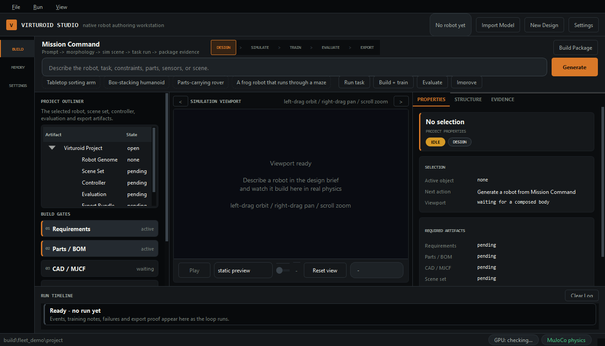
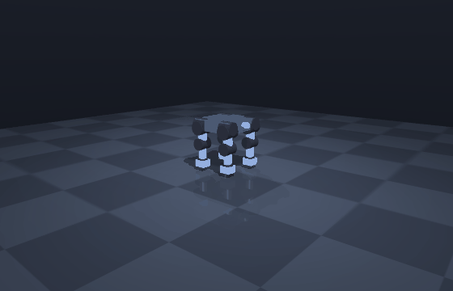
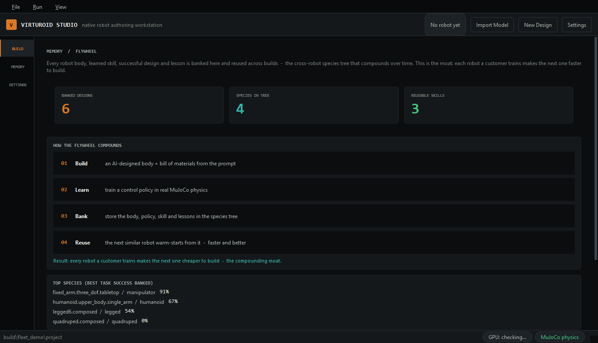

# Virturoid

**Describe a robot in plain language. Virturoid designs the body, sizes a real bill of materials, generates fabricable CAD, simulates the robot in real MuJoCo physics, and trains its controller. Every robot it builds makes the next one faster.**



Virturoid is an AI-native robot creation engine wrapped in a native desktop studio. You type what you want. It composes an original robot body, picks real off-the-shelf parts for it, builds the CAD and the bill of materials, drops it into a physics simulator, and teaches it to move.

## What it does

- **Generative design from a prompt.** A language model composes an original robot body, and a general anatomy compiler turns it into real geometry. Ask for a dog and you get a dog, with no per-species templates.
- **Real, buildable hardware.** Every joint is sized to a real actuator, with a full bill of materials covering actuators, sensors, compute, and power. The geometry exports to STEP and STL B-rep CAD you could hand to a fabricator.
- **Learned control, not scripts.** Bodies are trained in real MuJoCo physics. A quadruped learns to walk on the GPU. A tabletop arm learns a contact grasp and sorts blocks by color. The controller is one morphology-agnostic policy, so what it learns on one robot carries to the next.
- **A flywheel that compounds.** Every trained robot is banked in a cross-robot library, and the next similar robot warm-starts from it instead of training from scratch. On a sorting task, the second build of a robot reused prior work and cut the search by roughly 7.5x.



*A quadruped gait learned on the GPU and replayed in MuJoCo. The policy learns balance and propulsion on top of a gait prior, so the robot takes real steps and holds its posture.*

## How it works

Virturoid runs a clear, inspectable pipeline. Each stage produces a real artifact you can open and check.

```text
prompt  ->  body + bill of materials  ->  CAD + MuJoCo model
       ->  task and scenes  ->  physics simulation  ->  learned controller
       ->  cross-robot flywheel  ->  export bundle
```

- **Design.** A prompt becomes requirements, then an anatomy graph from a language model (or a deterministic composer when offline). One compiler realizes the geometry for any morphology.
- **Build.** Parametric CAD produces B-rep geometry exported to STEP and STL. Each joint gets a real actuator, and the system assembles a complete bill of materials. Every robot is buildable, not just renderable.
- **Simulate and learn.** The body compiles to a MuJoCo model and runs in real physics. Legged robots learn a gait, arms learn to grasp. Controllers are learned in the simulator.
- **Bank and reuse.** The converged body and its learned skill join a morphology vector space and a linked project memory, so the next robot starts from prior work.
- **Validate.** A readiness gate checks each stage against the artifacts on disk: real CAD, a real physics pass, measured task outcomes. A robot is marked export-ready only when the evidence is there.

Two AI loops run inside the system. One language model designs the body. A second reads how a gait turned out and tunes the training reward toward a cleaner result.

## The flywheel



Every build feeds the next. A learned gait, a converged body, a hard-won lesson: each one is banked and linked, so the next robot warm-starts instead of starting over. The longer Virturoid runs, the cheaper each new robot gets. That compounding library, not any single model, is the point.

## Quick start

```bash
python -m venv .venv && . .venv/bin/activate          # Windows: .venv\Scripts\activate
pip install -e ".[all]"                                # or ".[desktop,sim]" for just the studio
python -m virturoid.desktop                            # launch Virturoid Studio
```

Type a prompt in the studio. It composes the body, builds it, simulates it, trains a gait on request, and replays the real episode in an embedded 3D viewport.

It runs fully offline by default. To enable language-model design, set `VIRTUROID_LLM_BACKEND=openai` and an `OPENAI_API_KEY` in a local `.env`.

## Command line

The studio is the product, but the whole engine is scriptable.

```bash
# Compose a robot, co-design it into a working body, build and evaluate in real physics
python -m virturoid.compose --prompt "warehouse arm to move 2 kg boxes with 0.9 m reach" --co-design --build build/arm

# One command: prompt to a working, simulated robot
python -m virturoid.autobuild --prompt "a tabletop arm that sorts red and blue blocks into matching bins" --output build/sorter

# Train and export a controller bundle, plus a runnable ROS 2 package
python -m virturoid.build --train --prompt "a tabletop arm that sorts blocks" --output build/arm_train
```

Each build writes a full package: the robot model, generated task and scene sets, the bill of materials, parametric and B-rep CAD, training artifacts, a controller bundle, and browsable reports. Open `reports/index.html` in any package to explore everything it generated.

## Where it's going

Virturoid today designs and builds original robots, trains a quadruped to walk and arms to grasp, and compounds every result through the flywheel. Next on the path: learned humanoid locomotion, onboard perception for unknown environments, and transfer from simulation to physical hardware.
